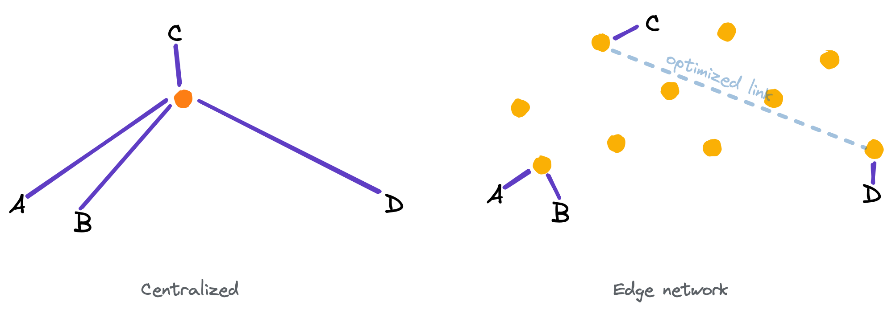
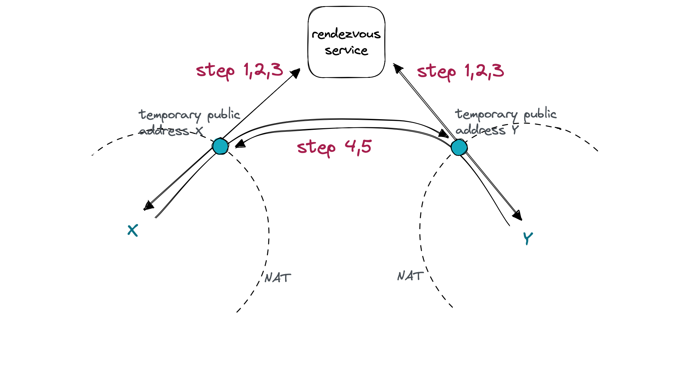

# TCP hole-punching and Edge function: how does all of these have to do with file transfer?

## Rendezvous

A device's IP address could change frequently.
How do we send a message from one device to another, if they haven't seen each other for some time?
Usually this is done by relaying the message through a public server, whose public address (e.g. IP, domain) remains unchanged for a long time.
Any device can connect to the public server, to send a message or to subscribe for incoming messages.

Files is just another kind of messages, albeit with larger sizes, so the relaying strategy also works for files.
However, relaying lays a huge burden on the server, and it is inefficient if devices are far away from the server.
A better strategy is to exchange the devices' address information through the server,
so that two devices can establish an ad hoc connection for file transfer.
Once the peer-to-peer (P2P) connection is established, we obtain a direct tunnel where we can transfer files without a relay server.
This strategy is exactly the basic working principle for a rendezvous server.

## Rendezvous at home

In a traditional approach, a rendezvous service runs as a single process,
because it needs to make connections with both side and obtain addresses from both.
Edge function changes this situation by providing computing endpoints distributed across the globe and optimized intra-connections among them.
Regardless of which instance a device connects to, its address information can be quickly sent to any other instance.

  

Take a look at how an edge network handles the two scenarios below:

1. A and B are geographically close, so they are able to find a common closest endpoint for rendezvous.
2. C and D are far from each other, but they can each find a closest endpoint,
   and those two endpoints are able to talk to each other efficiently.
   This is like walking towards your laptop and starting a video conference meeting with your friend who lives at the other end of the globe.

## Hole-punching

The idea of exchanging IP addresses is great, but not all devices own a public IP address.
Many devices are behind a facility called NAT (Network Address Translation).
In NAT, any time when a device try to connect to the outside world,
the device needs to "rent" a temporary public address from the NAT to associate with a device local address for a connection.
This association is called an address mapping pair.

In order for two devices behind two different NATs to establish a direct connection,
each needs to obtain an address mapping pair from its NAT.
The following steps take place to create such mappings and use them for P2P connection:

1. Outbound connection to a public address, i.e. the rendezvous service, creates a pair of address mapping
2. The rendezvous service is able to see the temporary public address of this connection.
3. The rendezvous service sends each device the temporary public address of the other.
4. Each device shut down the connection to the rendezvous service,
   and immediately *reuse* the connection's local address to open a connection to the other's temporary public address.
5. The new connections are able to reuse the mapping, and one of them will succeed.

  

*Still curious about the implementation?*
You can find the rendezvous service in [edge/index.ts](../edge/index.ts) and the client-side of hole-punching in [pkg/pnet/p2p.go](../pkg/pnet/p2p.go).
BTW, you would probably find it interesting to read [Tailscale's exteneded discussion on NAT traversal](https://tailscale.com/blog/how-nat-traversal-works/).
